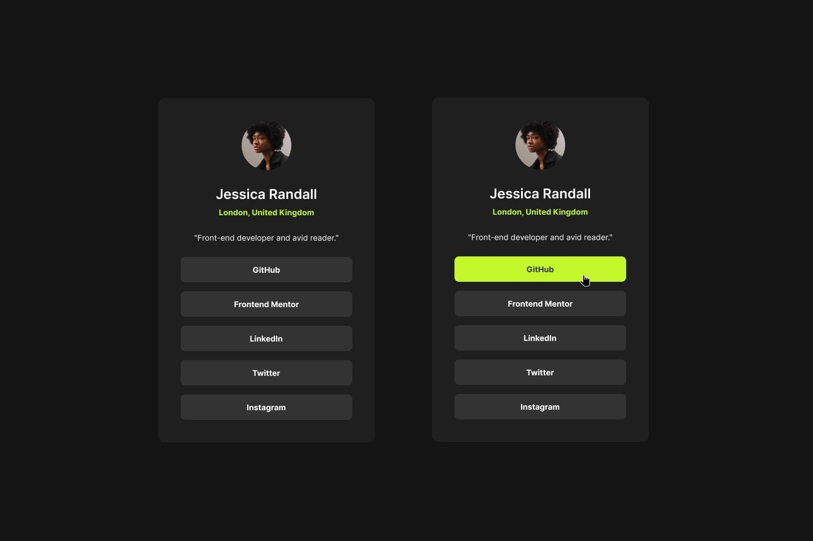

# Social Links Profile

This is a solution to the [Social links profile challenge on Frontend Mentor](https://www.frontendmentor.io/challenges/social-links-profile-UG32l9m6dQ). Frontend Mentor challenges help you improve your coding skills by building realistic projects. 

## Table of contents

- [Overview](#overview)
  - [The challenge](#the-challenge)
  - [Screenshot](#screenshot)
- [Implementarion](#implementation)
  - [What I learned](#what-i-learned)
- [Author](#author)

## Overview

### The challenge

Users should be able to:

- See hover and focus states for all interactive elements on the page

### Screenshot
Desktop Design: 1440 px  
The model includes hover feature in the social network links. 

Mobile design: 375 px

## Live URL
- https://utdevolt.github.io/JessicaRandall_ProfileChallenge/

## Implementation

### What I learned
I apply the mobile design rules, under "Mbile-first" paradigm. 

## Author
- Dayvid Ramos